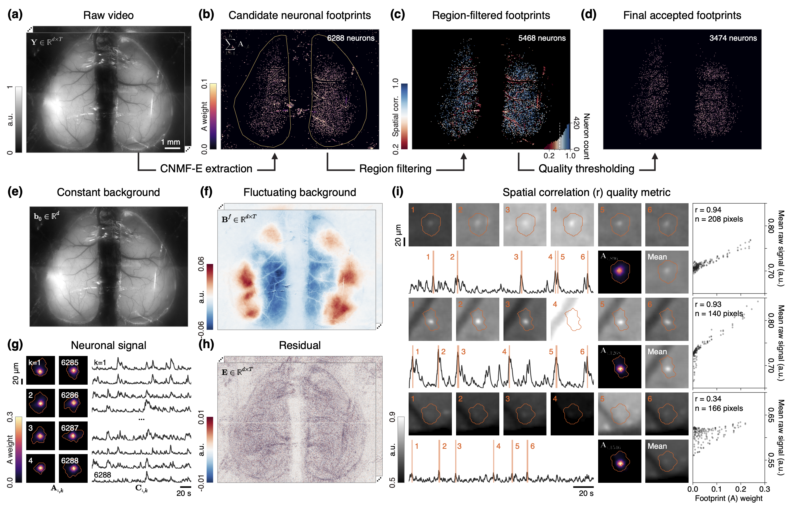
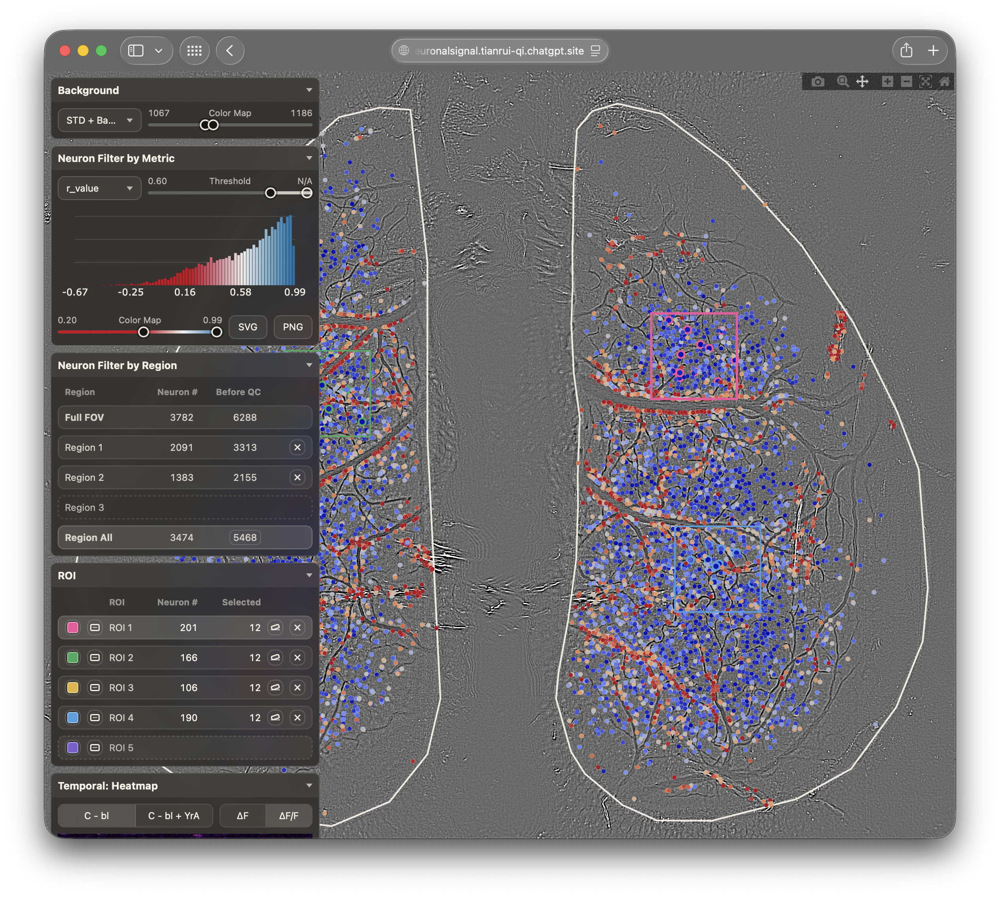
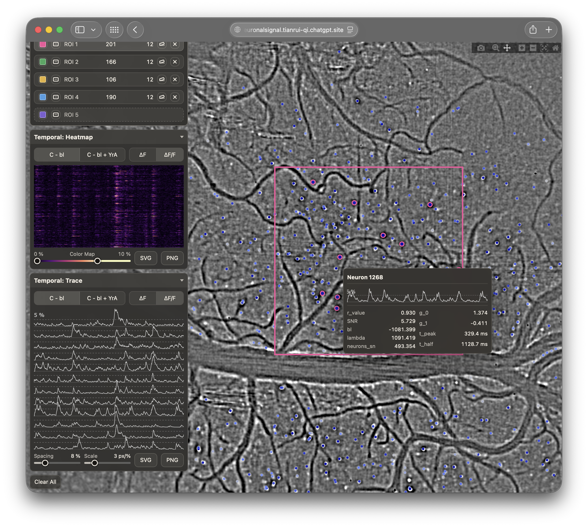

This repository provides the neuronal signal extraction
workflow used in [Bio-CM²](https://doi.org/10.64898/2026.07.27.740823).
Starting from a reconstructed calcium-imaging movie, neuronal spatial
footprints and temporal calcium signals are extracted with
[CNMF-E](https://github.com/zhoupc/cnmf_e), as implemented in
[CaImAn](https://github.com/flatironinstitute/CaImAn).
A companion [note](https://tianrui-qi.craft.me/CNMF-E) provides additional mathematical background on the CNMF-E formulation.
The extracted neurons are then inspected and filtered in an interactive viewer.
Please visit [cm2-neuronalsignal.tianrui-qi.chatgpt.site](https://cm2-neuronalsignal.tianrui-qi.chatgpt.site) to explore provided results without installing the project.



## Installation

### Environment

This project uses [CaImAn](https://github.com/flatironinstitute/CaImAn) (`caiman=1.13`)
for neuronal signal extraction,
[Plotly](https://github.com/plotly/plotly.py) for interactive visualization,
[Flask](https://github.com/pallets/flask) for serving the local web viewer,
and [Hydra](https://github.com/facebookresearch/hydra) (`hydra-core=1.3`) for
configuration management.
Python dependencies are managed with [Conda](https://docs.conda.io/en/latest/).
To set up the environment:

```bash
# clone the repository
git clone https://github.com/tianrui-qi/CM2-NeuronalSignal.git
cd CM2-NeuronalSignal
# create the conda environment
conda env create -f environment.yaml
conda activate cm2-neuronalsignal
```

Run all commands below from the repository root with the `cm2-neuronalsignal` environment active.
The same environment supports both neuronal signal extraction and local viewing; no separate frontend installation is required.

### Data

The reconstructed calcium-imaging movie, saved CNMF-E models with different
initialization settings, and the precomputed cache used by the online viewer
are shared through public iCloud file links listed in
[`config/setup.yaml`](config/setup.yaml).

```text
data/
├── raw/
│   └── Y.tif
├── cnmfe/
│   ├── Y-corr85-pnr12.hdf5
│   ├── Y-corr80-pnr11.hdf5
│   ├── Y-corr80-pnr10.hdf5
│   └── Y-corr70-pnr10.hdf5
└── cache/
    └── Y-corr85-pnr12/
```

Run the following command to resolve all iCloud links and download the shared artifacts.
Before running it, make sure the target files or directories do not already exist under data/{raw,cnmfe,cache}/.

```bash
python -m script.setup
```

See [Neuronal Signal Extraction](#neuronal-signal-extraction) and [Neuronal Signal Viewer](#neuronal-signal-viewer) to learn how these artifacts are generated and used.

### Configuration

Each runnable entry point under [`script/`](script/) has a matching [Hydra](https://github.com/facebookresearch/hydra) configuration file under [`config/`](config/), i.e., `script/<stage>.py` loads `config/<stage>.yaml`. 
These files define load/save paths and stage-specific settings.
Any configured value can be overridden from the command line using Hydra's
[override syntax](https://hydra.cc/docs/advanced/override_grammar/basic/).
Hydra also supports
[multi-run](https://hydra.cc/docs/tutorials/basic/running_your_app/multi-run/),
allowing a stage to be run over multiple configurations from a single command.
Check the official Hydra [documentation](https://hydra.cc/docs/intro/) for a more comprehensive overview of its features and usage.

## Neuronal Signal Extraction

We use [CNMF-E](https://github.com/zhoupc/CNMF_E), as implemented in
[CaImAn](https://github.com/flatironinstitute/CaImAn), to extract neuronal
signals from the reconstructed calcium-imaging movie.
For additional mathematical background, see the CNMF-E formulation [note](https://tianrui-qi.craft.me/CNMF-E)
For a quick intro to running CNMF-E with CaImAn, see the official
[demo](https://github.com/flatironinstitute/CaImAn/blob/main/demos/notebooks/demo_pipeline_cnmfE.ipynb).

First, convert the reconstructed movie `<name>.tif` to a CaImAn-compatible memory-mapped file, `<name>_d1_<height>_d2_<width>_d3_1_order_C_frames_<frames>.mmap`. The mmap provides memory-efficient access to the full movie during CNMF-E fitting without loading the entire TIFF stack into memory. Its filename encodes the movie dimensions, memory order, and frame count. These values are read back when the mmap is loaded, so preserve the generated name.

```bash
python -m script.mmap \
    raw_load_path=data/raw/Y.tif \
    mmap_save_stem=data/mmap/Y
```

Then fit CNMF-E using the generated `.mmap` and save the resulting model to `.hdf5` file. 
The saved `.hdf5` model can later be reloaded directly with CaImAn without rerunning CNMF-E.

```bash
python -m script.cnmfe \
    mmap_load_path=data/mmap/Y_d1_2692_d2_3548_d3_1_order_C_frames_1788.mmap \
    cnmfe_save_path=data/cnmfe/Y-corr85-pnr12.hdf5
```

All CNMF-E hyperparameters are configured in [`config/cnmfe.yaml`](config/cnmfe.yaml) under `params`. 
The default settings are tuned for the provided movie, but you can adjust them to explore different fits.
The example below overrides `min_corr=0.70` and `min_pnr=10` for neuron initialization, which yield more neurons than the default settings.

```bash
python -m script.cnmfe \
    mmap_load_path=data/mmap/Y_d1_2692_d2_3548_d3_1_order_C_frames_1788.mmap \
    cnmfe_save_path=data/cnmfe/Y-corr70-pnr10.hdf5 \
    params.init.min_corr=0.70 \
    params.init.min_pnr=10
```

Four CNMF-E models fitted with different initialization settings are provided in `data/cnmfe/` (see [Data](#data)). 
After loading a model with CaImAn, its estimated variables are available through `.estimates` and can be combined according to the [CNMF-E formulation](https://tianrui-qi.craft.me/CNMF-E) to derive quantities of interest.
For example, the code below creates a neuronal-footprint map `a_sum` by summing the spatial footprints of all neurons $\sum_{i=1}^{K}\mathbf{A}_{:,i}$.

```python
import numpy as np
from caiman.source_extraction.cnmf.cnmf import load_CNMF
cnmfe = load_CNMF("data/cnmfe/Y-corr85-pnr12.hdf5")
a_sum = np.asarray(
    cnmfe.estimates.A.sum(axis=1)
).reshape(tuple(cnmfe.estimates.dims), order="F")
```

The results can also be explored interactively using the viewer described in [Neuronal Signal Viewer](#neuronal-signal-viewer). 

## Neuronal Signal Viewer

The interactive viewer displays extracted neurons across the full field of
view and supports quality filtering, spatial grouping, and comparison of
temporal activity.

### Cache

Rather than loading the large files directly, the viewer reads from a precomputed cache.  
To build a cache from a movie `.mmap` and its fitted CNMF-E model in `.hdf5` format,

```bash
python -m script.cache \
    mmap_load_path=data/mmap/Y_d1_2692_d2_3548_d3_1_order_C_frames_1788.mmap \
    cnmfe_load_path=data/cnmfe/Y-corr85-pnr12.hdf5 \
    cache_save_fold=data/cache/Y-corr85-pnr12/
```

A cache completely determines the movie and CNMF-E result displayed by the viewer.
Thus, to view a different result, first build a separate cache for it.
For example, to view the result from a different CNMF-E model fitted to the same movie,

```bash
python -m script.cache \
    mmap_load_path=data/mmap/Y_d1_2692_d2_3548_d3_1_order_C_frames_1788.mmap \
    cnmfe_load_path=data/cnmfe/Y-corr70-pnr10.hdf5 \
    cache_save_fold=data/cache/Y-corr70-pnr10/
```

A precomputed cache for the `Y-corr85-pnr12.hdf5` model is already provided in
`data/cache/Y-corr85-pnr12/`.
You can [serve](#serve) the viewer with this cache without rebuilding it.

### Serve

With the cache prepared, serve the viewer locally by running:

```bash
python -m script.serve \
    cache_load_fold=data/cache/Y-corr85-pnr12/
```

As you interact with the viewer, your current state is saved in your browser's `localStorage`.
Reloading the page restores your previous session.
Click _Clear All_ to clear all saved user state.
To save a particular viewer state, start the local viewer with `edit_default=true` and specify where the state should be saved:

```bash
python -m script.serve \
    cache_load_fold=data/cache/Y-corr85-pnr12/ \
    serve_path=data/serve/Y-corr85-pnr12.json \
    edit_default=true
```

In this mode, the viewer saves the complete user state to `serve_path`.
The resulting `.json` file can be used as the default state.
When the viewer is served normally with `edit_default=false`, users can click _Restore Default_ to return to the saved state stored at `serve_path`.

We provide the default state
[`data/serve/Y-corr85-pnr12.json`](data/serve/Y-corr85-pnr12.json) for cache `data/cache/Y-corr85-pnr12/`, with a representative set of neurons selected.
An online viewer is also available at [cm2-neuronalsignal.tianrui-qi.chatgpt.site](https://cm2-neuronalsignal.tianrui-qi.chatgpt.site), hosted through OpenAI Sites.

<p align="center">
  
  
</p>

## Acknowledgements

This project was developed by [Tianrui Qi](https://www.linkedin.com/in/tianrui-qi/) during his second Ph.D. lab rotation in [Computational Imaging Systems Lab](https://sites.bu.edu/tianlab/) at Boston University.
Thanks to [Dr. Lei Tian](https://www.linkedin.com/in/lei-tian-3003a217/) for hosting the rotation and guiding the project. 
This work is part of [Bio-CM²](https://doi.org/10.64898/2026.07.27.740823), led by [Guorong Hu](https://www.linkedin.com/in/guorong-hu-53a550250/), with contributions from [Qilin Deng](https://www.linkedin.com/in/qilin-deng-431713287/) and [Zhixiong Chen](https://www.linkedin.com/in/czx120464233/). 
Thanks to all of them for their close collaboration, helpful discussions, and support throughout the project.

## References

1.  Giovannucci, A. et al. [CaImAn an open source tool for scalable calcium imaging data analysis.](https://doi.org/10.7554/eLife.38173) *eLife* **8**, e38173 (2019).

2.  Zhou, P. et al. [Efficient and accurate extraction of in vivo calcium signals from microendoscopic video data.](https://doi.org/10.7554/eLife.28728) *eLife* **7**, e28728 (2018).

3.  Friedrich, J. et al. [Multi-scale approaches for high-speed imaging and analysis of large neural populations.](https://doi.org/10.1371/journal.pcbi.1005685) *PLoS Comput. Biol.* **13**, e1005685 (2017).

4.  Friedrich, J., Zhou, P. & Paninski, L. [Fast online deconvolution of calciumimaging data.](https://doi.org/10.1371/journal.pcbi.1005423) *PLoS Comput. Biol.* **13**, e1005423 (2017).

5.  Pnevmatikakis, E. A. et al. [Simultaneous Denoising, Deconvolution, and Demixing of Calcium Imaging Data.](https://doi.org/10.1016/j.neuron.2015.11.037) *Neuron* **89**, 285–299 (2016).
